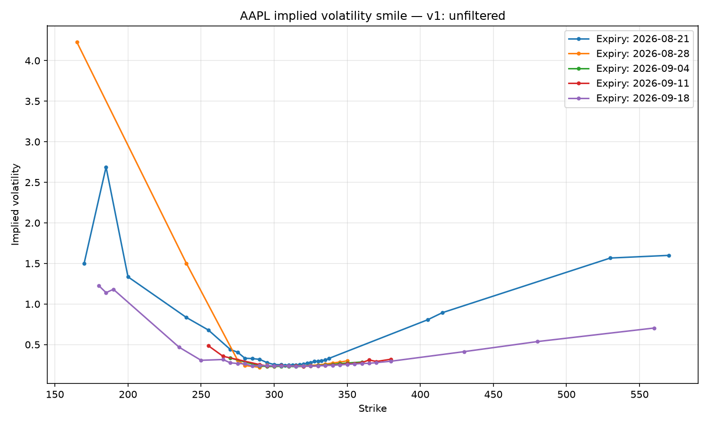
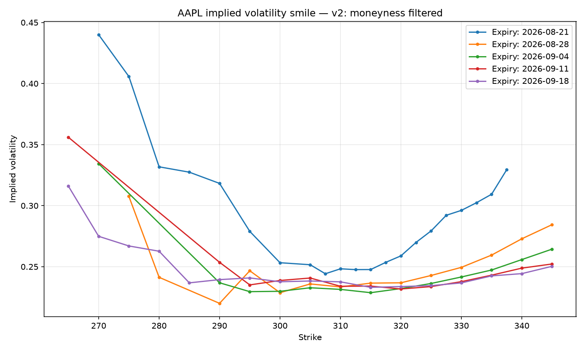
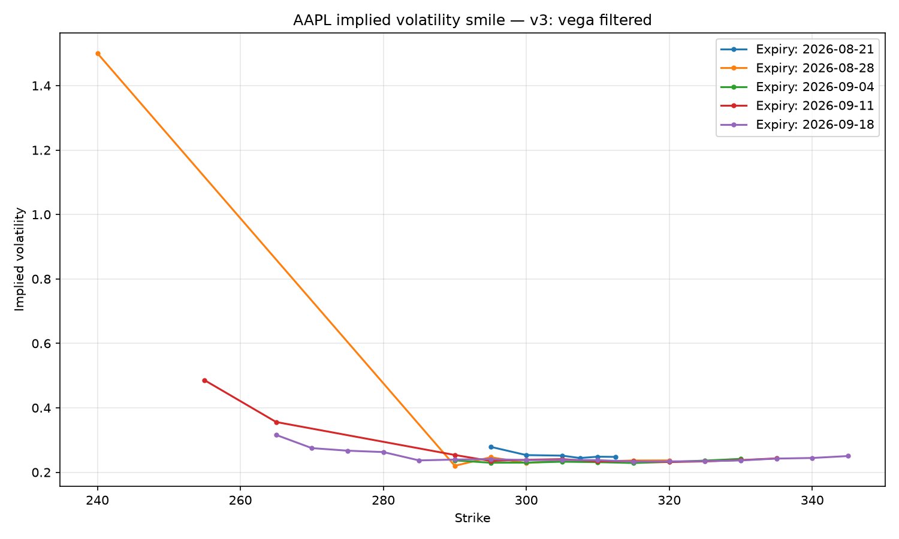
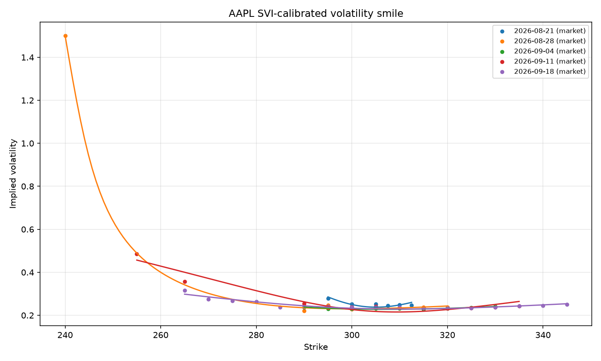

# Quant Pricing Toolkit


A Python toolkit for derivatives pricing, volatility calibration, and portfolio risk (VaR/CVaR)

## Overview

This project implements multiple option pricing methods (closed-form, tree-based, Monte Carlo, PDE), 
computes option Greeks, calibrates volatility surfaces to real market data, and provides portfolio 
risk metrics (VaR/CVaR) with statistical backtesting.

## Contents

- [Pricing methods](#pricing-methods)
- [Option Greeks](#option-greeks)
- [Volatility surface calibration](#volatility-surface-calibration)
- [Risk management](#risk-management)
- [End-to-end example](#end-to-end-example)
- [Repository structure](#repository-structure)
- [Limitations & future work](#limitations--future-work)

## Motivation : Why this project

I built this project to get a head start on my Master's in Mathematics & Finance at Imperial College London and to gain hands-on exposure to real-world quantitative research.

## Key results

- Four independent pricing methods (Black-Scholes, binomial tree, Monte Carlo, PDE) cross-validated 
  to within 0.05 of each other on a European call.
- Analytical and numerical Greeks agree to within 1e-4–1e-8.
- SVI calibration on real AAPL option data consistently recovers a negative rho (skew), 
  confirming the expected equity smile shape.
- Diagnosed and fixed a data-cleaning issue: yfinance returns bid=0/ask=0 on 100% of AAPL 
  quotes, invalidating a bid-ask spread filter; switched to a volume + Vega filter targeting 
  the actual root cause of unreliable implied volatilities.
- Historical, parametric, and Monte Carlo VaR agree within ~7% on synthetic normal data; 
  CVaR and a Kupiec backtest were implemented to validate and extend the VaR estimates.

## Installation

```bash
git clone https://github.com/ines-tag82/quant-pricing-toolkit.git
cd quant-pricing-toolkit
python -m venv venv
source venv/bin/activate  # or venv\Scripts\activate on Windows
pip install -e ".[dev]"
```

## Pricing methods

Four independent pricing methods are implemented and cross-validated against each other 
(all converge to the same Black-Scholes value for a European option):

| Method | Supported Options | Notes |
|---|---|---|
| Black-Scholes (closed-form) | European | Instant, exact under model assumptions |
| Binomial tree (CRR) | European & American | Converges to Black-Scholes as `n_steps` increases |
| Monte Carlo | European | Includes antithetic variates for variance reduction |
| PDE (Crank-Nicolson) | European | Finite-difference solution of the Black-Scholes PDE |

### Black-Scholes pricing (closed-form)

```python
from qpt.models.market_data import MarketData
from qpt.instruments.european_option import EuropeanOption, OptionType
from qpt.models.black_scholes import black_scholes_price

market = MarketData(spot=100, rate=0.05, volatility=0.20)
call = EuropeanOption(strike=100, maturity=1.0, option_type=OptionType.CALL)

price = black_scholes_price(call, market)  # ~10.45
```

### Binomial tree pricing (CRR)

Tree-based pricing for European and American options, using the Cox-Ross-Rubinstein model.

```python
from qpt.pricing.binomial_tree import binomial_tree_price

price = binomial_tree_price(call, market, n_steps=500, american=False)

put = EuropeanOption(strike=110, maturity=1.0, option_type=OptionType.PUT)
american_price = binomial_tree_price(put, market, n_steps=200, american=True)
```

### Monte Carlo pricing

Simulation-based pricing with optional antithetic variates for variance reduction. 
Returns both the price estimate and its standard error.

```python
from qpt.pricing.monte_carlo import monte_carlo_price

price, stderr = monte_carlo_price(call, market, n_paths=100_000, antithetic=True, seed=42)
```

### PDE pricing (Crank-Nicolson)

Finite-difference solution of the Black-Scholes PDE, using an unconditionally stable, 
second-order accurate Crank-Nicolson scheme.

```python
from qpt.pricing.pde import pde_price

price = pde_price(call, market, M=200, N=200)  # ~10.44
```

## Option Greeks

Both analytical (closed-form, Black-Scholes) and numerical (finite-difference, model-agnostic) 
Greeks are implemented and cross-validated against each other.

```python
from qpt.greeks.analytical_greeks import delta_call, gamma, vega, theta_call, rho_call

delta_call(call, market)   # ~0.6368
gamma(call, market)        # ~0.0188
vega(call, market)         # ~37.52
theta_call(call, market)   # ~-6.41
rho_call(call, market)     # ~53.23
```

Numerical Greeks work with any pricing function, not just Black-Scholes:

```python
from qpt.greeks.numerical_greeks import numerical_delta
from qpt.models.black_scholes import black_scholes_price

numerical_delta(black_scholes_price, call, market)  # ~0.6368, matches the analytical value
```

Cross-validation between the two approaches agrees to within `1e-4` and `1e-8`. A put-call parity 
identity on Delta (`Delta_call - Delta_put == exp(-q*T)`) is also tested as a no-arbitrage 
sanity check.

## Volatility surface calibration

Real market data was fetched for AAPL via `yfinance`, cleaned, and used to extract implied 
volatilities and calibrate a parametric Stochastic Volatility Inspired model (SVI), one 
maturity slice at a time.

### From raw data to a usable smile

The raw option chain contains a lot of noise, and cleaning it properly required an iterative, 
diagnostic approach rather than a single fixed set of filters. Three stages of increasingly 
targeted filtering are compared below:

<table>
<tr>
<td width="33%"></td>
<td width="33%"></td>
<td width="33%"></td>
</tr>
<tr>
<td align="center"><b>(a)</b> Unfiltered</td>
<td align="center"><b>(b)</b> Moneyness-restricted (0.85–1.15)</td>
<td align="center"><b>(c)</b> Volume + Vega filtered</td>
</tr>
</table>

**(a) Unfiltered**: implied volatilities computed from all fetched quotes, with only basic 
liquidity filters (min price, days to expiry). Dominated by artifacts, implied volatilities of 
100–400% on deep in/out-of-the-money strikes, not economically meaningful.

**(b) Moneyness-restricted**: restricting strikes to 85–115% of spot removes most of the noise, 
but discards data based on distance from spot rather than the actual reliability of the quote.

**(c) Volume + Vega filtered**: a more principled approach, implied volatility extraction is 
numerically unstable when Vega is low, so a small pricing error translates into a large implied 
volatility error. Filtering directly on Vega (`>= 10`) combined with a minimum trading volume 
(`>= 5`) addresses the root cause rather than a proxy for it.

*A bid-ask spread filter was initially planned, but `yfinance` returns `bid=0` and `ask=0` for 
100% of AAPL option quotes at the time of testing (a known limitation of this free data source). 
Trading volume was used as a liquidity proxy instead.*

### SVI calibration

```python
from qpt.calibration.svi import calibrate_svi_surface

surface = calibrate_svi_surface(df_smile)
# surface[expiry] -> {"a", "b", "rho", "m", "sigma", "spot", "maturity"}
```



Slices with enough strikes produce smooth curves that closely track the market smile, with a 
negative `rho` consistently recovered, confirming the downward skew typically observed on 
single-stock equity options. Slices with very few strikes are prone to overfitting (see 
[Limitations](#limitations--future-work)).

## Risk management

Three independent VaR methods, CVaR (Expected Shortfall), and a Kupiec backtest are implemented 
and cross-validated on a synthetic portfolio.

```python
from qpt.risk.var import historical_var, parametric_var, monte_carlo_var, historical_cvar, kupiec_test

historical_var(returns, portfolio_value, confidence_level=0.95)   # ~3,002
parametric_var(returns, portfolio_value, confidence_level=0.95)   # ~3,131
monte_carlo_var(spot=100, drift=..., volatility=..., horizon=1/252,
                 portfolio_value=portfolio_value, confidence_level=0.95)  # ~3,205
```

| Method | Assumption | Notes |
|---|---|---|
| Historical | None (non-parametric) | Empirical quantile of past returns |
| Parametric (delta-normal) | Normally distributed returns | Fast, but understates tail risk with fat tails |
| Monte Carlo | GBM-simulated scenarios | Reuses the pricing engine; extends to non-linear payoffs |

```python
historical_cvar(returns, portfolio_value, confidence_level=0.95)  # ~3,804, >= VaR as expected

kupiec_test(returns, var_estimate, portfolio_value, confidence_level=0.95)
# {'n_exceptions': 50, 'exception_rate': 0.05, 'expected_rate': 0.05, 'p_value': 1.0}
```

## End-to-end example

`examples/05_end_to_end.py` chains every component together: fetch real AAPL option data → 
clean it → calibrate an SVI surface → price an option using the calibrated, market-implied 
volatility (rather than an arbitrary assumption) → compute Greeks → run VaR/CVaR/backtesting 
on a portfolio consistent with that same volatility.

```bash
python examples/05_end_to_end.py
```

Other standalone examples are also implemented: `01_black_scholes.py`, `02_pricing_methods_comparison.py`, 
`03_volatility_smile.py`, `04_risk_var_cvar.py`.

## Running tests

```bash
pytest tests/ -v
```

Continuous integration runs the full test suite automatically on every push via GitHub Actions.

## Repository structure

quant-pricing-toolkit/
├── src/qpt/
│   ├── instruments/      # option definitions (strike, maturity, payoff)
│   ├── models/           # Black-Scholes, market data
│   ├── pricing/          # binomial tree, Monte Carlo, PDE
│   ├── greeks/           # analytical & numerical Greeks
│   ├── calibration/      # implied vol, SVI surface calibration
│   ├── risk/             # VaR, CVaR, backtesting
│   └── data/             # market data fetching & cleaning
├── tests/                # unit tests (pytest)
├── examples/             # standalone runnable scripts, one per phase
├── assets/               # generated plots referenced in this README
└── pyproject.toml

## Limitations & future work

- **Data source reliability**: `yfinance` bid/ask quotes are unreliable (0/0 on all AAPL 
  contracts tested), trading volume was used as a liquidity proxy instead, but a professional 
  data feed would give more robust filtering.
- **SVI overfitting on sparse slices**: maturities with very few available strikes can produce 
  SVI curves that diverge sharply outside the fitted points, since 5 free parameters overfit a 
  handful of data points. A minimum-points threshold or regularization would mitigate this.
- **Residual outlier in cleaned smile data**: one option (strike 240, AAPL, expiry 2026-08-28) 
  keeps an unrealistic ~150% implied volatility despite Vega and volume filtering, likely driven 
  by the constant risk-free rate assumption interacting with a deep-in-the-money price. Kept 
  visible rather than filtered out, to document the limits of the cleaning pipeline honestly.
- **Kupiec backtest is in-sample**: the historical VaR is backtested on the same data used to 
  calibrate it, so the exception rate matches the theoretical rate almost by construction. A 
  proper robustness check would calibrate VaR on one historical window and backtest on a 
  separate, later period.
- **PDE accuracy on short maturities**: the default grid (`M=200, N=200`) shows larger deviation 
  from the other pricing methods on very short maturities (a few days), suggesting the 
  discretization would benefit from a finer time grid in that regime.
- **Single risk-free rate**: `rate=0.05` is used as a constant across all maturities and models. 
  A real term structure of rates (different rate per maturity) would improve consistency, 
  particularly for the deep in/out-of-the-money options mentioned above.


